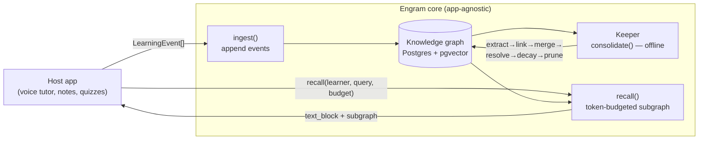
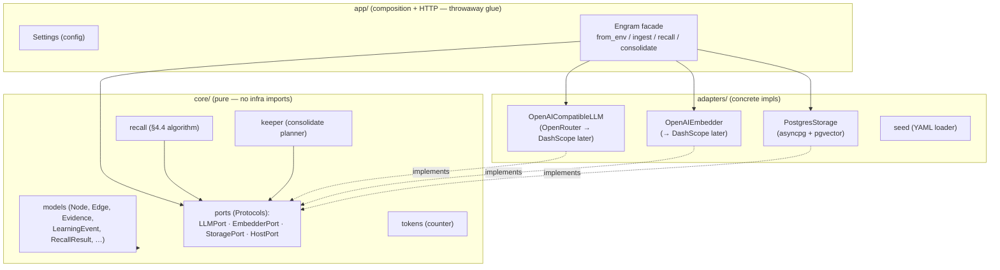
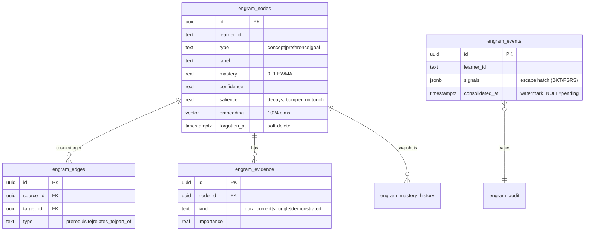
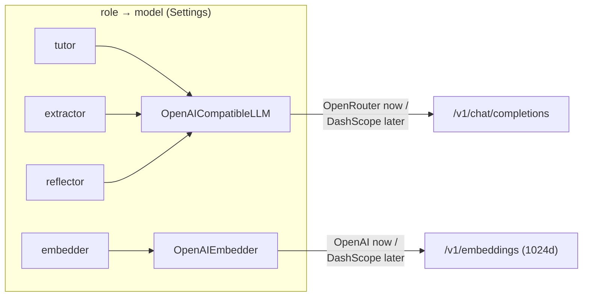
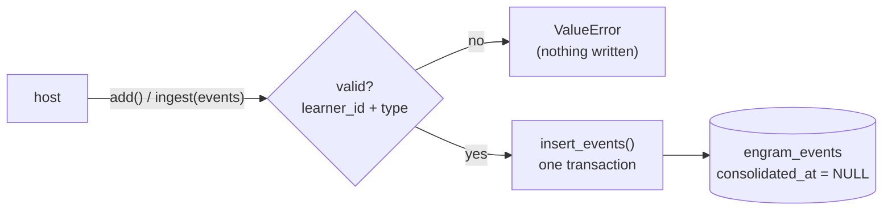
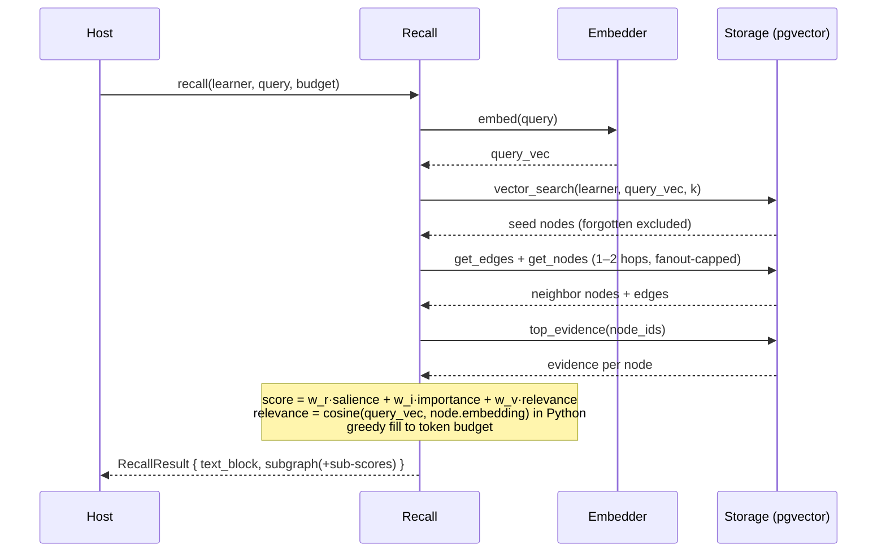
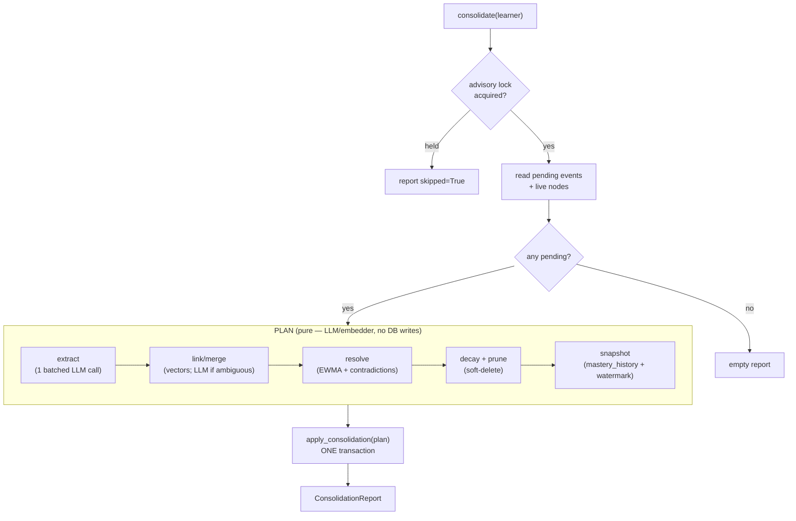
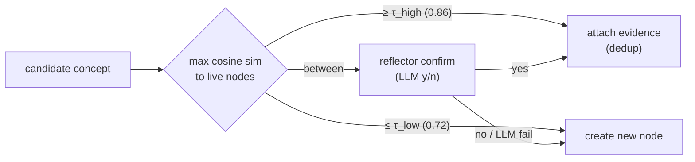
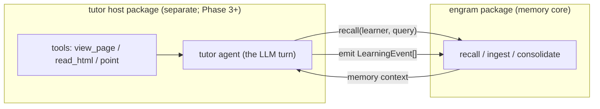

# Engram — Architecture

> **Living document.** Unlike `DESIGN.md` (the original vision/spec), this records
> the architecture **as actually built**, decision by decision, and is updated as
> each phase lands. Diagrams are intentionally small and scoped — one per system
> or subsystem — so each is easy to hold in your head.
>
> **Status legend:** ✅ built & tested · 🟡 designed, not yet built · ⬜ future phase
>
> | Phase | Area | Status |
> |---|---|---|
> | 0 | Foundations (core, ports, schema, adapters, facade) | ✅ |
> | 1 | Ingest + Recall (read path) | ✅ |
> | 2 | Memory Keeper (`consolidate`) | ✅ |
> | 3 | Text tutor (`/chat`) | ⬜ |
> | 4 | React console | ⬜ |
> | 5 | Eval + polish | ⬜ |

---

## 1. System overview

Engram is an **app-agnostic learner-memory core**: a host feeds it generic
`LearningEvent`s; an offline **Keeper** distils them into a knowledge graph; a fast
**Recall** reads a token-budgeted subgraph for the live tutor. The graph is the
single source of truth — the tutor never reasons over raw history.



**Two agents over one graph.** Expensive reasoning is **offline** in the Keeper
(amortized per "sleep"); the live turn is one cheap Recall (no LLM on the hot
path). See [DESIGN.md](DESIGN.md) §0 for the rationale.

---

## 2. Layering (ports & adapters)

The asset is the **core**; everything provider- or transport-specific is an
**adapter** or **app glue**. `core/` imports nothing from `adapters/` or `app/`.



**Why split `LLMPort` and `EmbedderPort`?** OpenRouter (chat) has no embeddings
endpoint, so embeddings go to OpenAI. Separate ports let each swap to DashScope
independently when we move to Alibaba — a config + preset change, no core edits.

---

## 3. Data model

Six learner-scoped tables (`migrations/0001_engram_schema.sql`). Bounded type sets
keep LLM cost down and the graph legible — the Keeper cannot invent types.



Three append-only streams give observability: `engram_events` (in), `engram_audit`
(every Keeper/Recall op + rationale), `engram_mastery_history` (per-node
trajectories). `embedding` is `vector(1024)` — the single source of truth for the
dimension; must match `ENGRAM_EMBEDDING_DIM`.

---

## 4. Provider seam (Phase 0) ✅

One `OpenAICompatibleLLM` (chat) + one `OpenAIEmbedder`, wired by `Settings`'
role→model map. The Alibaba switch is a base-url/key change plus a DashScope
preset — no core changes.



---

## 5. Ingest (Phase 1) ✅

Append-only, no LLM, no embedding — the cheap write path. Validates each event,
inserts in one transaction with `consolidated_at = NULL` (the Keeper's queue).



---

## 6. Recall (Phase 1) ✅

The §4.4 read path: vector-seed → bounded graph hop → score → token-budget fill.
**No LLM on the hot path** (one embedding + a vector query + a bounded traversal).
The hybrid (vector-seed + graph expansion) is the efficiency consensus from the
2026 GraphRAG/HippoRAG literature — see [DESIGN.md](DESIGN.md) §12 / MVP spec §12.



Scoring weights (`w_r/w_i/w_v=0.3/0.3/0.4`) and traversal params (`seed_k/hops/
fanout`) live in `Settings`, env-overridable so the eval harness can sweep them.

---

## 7. Memory Keeper — `consolidate()` (Phase 2) ✅

The core IP: turns pending events into graph. **Plan, then commit** — a *pure*
planner produces a `ConsolidationPlan`; the only DB writes happen in one atomic
`apply_consolidation`. Crash mid-plan → nothing written → safe re-run.



**Link/merge decision** (vectors first, LLM only in the ambiguous band):



**Mastery (EWMA).** Each evidence kind → an observation (`quiz_correct=1.0`,
`quiz_wrong=0.0`, `demonstrated=0.9`, `struggle=0.2`; `note/explained/asked_about`
skip), overridden by explicit event `signals` (signal-greedy). Then
`mastery = α·obs + (1−α)·mastery_old` (α=0.3). Confidence rises on agreement, dips
on conflict (which logs a `resolve_contradiction` audit row). **Forgetting:**
untouched nodes `salience *= decay^Δt`; below `prune_floor` → `forgotten_at` set.

Idempotent by construction: the watermark advances only inside the committed
transaction; the advisory lock serializes per-learner runs. Full detail in the
[Phase 2 spec](superpowers/specs/2026-06-17-engram-phase-2-memory-keeper-design.md).

---

## 8. Public API surface

mem0-style ergonomics over typed depth. The library is the primary surface; the
FastAPI app (Phase 3) re-exposes the same verbs over HTTP for non-Python hosts.

| Verb | Alias | Phase | What |
|---|---|---|---|
| `ingest(events)` | `add` | 1 ✅ | append `LearningEvent`s |
| `recall(learner, query, budget)` | `search` | 1 ✅ | token-budgeted subgraph |
| `consolidate(learner)` | — | 2 ✅ | run the Keeper |
| `graph(learner, focus?)` | — | 4 ⬜ | render-ready view |

```python
eng = Engram.from_env()      # wires PostgresStorage + OpenRouter LLM + OpenAI embedder
await eng.connect()
await eng.add(events, ...)    # ingest
ctx = await eng.recall("derivatives", learner_id="alice", budget=800)
report = await eng.consolidate(learner_id="alice")   # Phase 2
```

---

## 9. Host/tutor boundary — tools live in the tutor, not in Engram

A strict line the whole design rests on: **Engram is memory, not the agent that
acts.** Tools (view the page, read its HTML, point at an element, render a slide),
perception, STT/TTS, and UI are **host/tutor** concerns. Engram never knows what a
"page" or "PDF" is — it only stores events and serves recalled context. This is
what keeps the memory core droppable into *any* host.

**Decision (2026-06-17):** the tutor ships as a **separate package** depending on
`engram`, with its own **tool plugin interface** (register tools like
`view_page` / `read_html` / `point`). `engram` stays pure memory.



Flow: *a tool perceives → the tutor reasons (with Engram's recalled memory in its
prompt) → the tutor emits events → Engram remembers.* Tools feed the tutor; the
tutor feeds Engram. Adding a new perception tool is a tutor change, never an
Engram change. (clicky, if used as a host, plugs in exactly here — via the HTTP
service since its backend is a non-Python Cloudflare Worker.)

---

## 10. Deployment & the Alibaba switch (future)

Backend (FastAPI + Keeper cron) targets Alibaba ECS/SAE; DB → Alibaba
RDS/PolarDB (pgvector); inference → DashScope. All built-for via the provider seam
(§4) — no core changes, a config + DashScope-preset swap. Detail lands here when
Phase 5 deployment is built.
